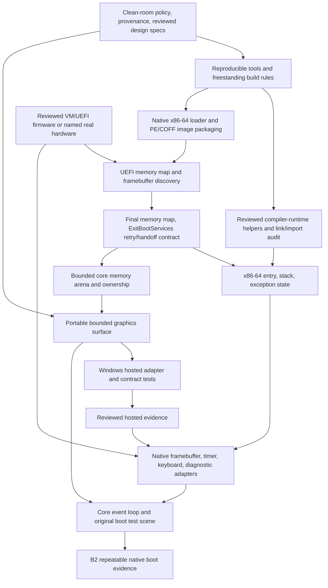

# Boot definitions and dependency graph

Status: acceptance contracts, not achieved boot claims.

## Three distinct gates

**B0 — bootstrap build:** the documented tools compile a native Windows development
probe, a compile-only freestanding width probe, and run CTest. Two fresh build
directories produce the same probe executable hash with the pinned environment.
This is the first reproducible build; it is not an OS boot.

**B1 — first hosted ClasSICK start (M0.1):** a native Windows process initializes
our core using supplied arenas, renders an independently authored test scene
through an abstract surface, consumes normalized synthetic and live input, and
exits cleanly. Headless bounds/ownership/event tests pass. No Toolbox compatibility
claim is required to meet B1. This is a hosted development start.

**B2 — first successful native OS boot (M0.2):** on one named x86-64 UEFI VM/PC
configuration, an independently built native image:

1. Loads without Apple code, a Macintosh machine environment, or a hosted OS
   process providing its kernel services.
2. Validates the firmware memory map and framebuffer descriptor; successfully
   calls `ExitBootServices` and transfers to our kernel-owned entry/stack.
3. Uses its own bounded memory arena, initializes required CPU exception state,
   and draws a deterministic original geometric scene through the core surface
   API using post-handoff framebuffer writes.
4. Maintains a visible progress counter for at least 60 seconds using an owned
   timing source. No boot-service callbacks provide ongoing execution or I/O.
5. Receives a keyboard event through our selected platform driver after handoff,
   changes the scene, and records a bounded diagnostic trace. The first VM may
   use a simple PS/2 device; USB-only PC support is a separate driver gate.
6. Has evidence tied to the source revision, toolchain hashes, image hash, firmware
   version/hash, machine configuration, boot transcript, and safe original-scene
   screenshot. Repeating from power-on yields the same observable pass sequence.

A firmware application showing text before handoff does not satisfy B2. The
kernel can initially use polling and cooperative execution; preemptive scheduling,
Toolbox, MFS, and a 68000 interpreter are not prerequisites for B2.

## Dependency graph for B2

Develop surface contracts using caller-owned test storage before kernel arena
integration. The diagram shows boot-time dependencies as well as implementation
gates; it does not require the allocator to precede surface design.

## Macintosh 128K native boot gate

M0.3 has a separate hardware/specification and size-budget gate. Our replacement
ROM/startup and native 68000 image must initialize required RAM, display, input,
exceptions and progress without executing Apple ROM code. Record the exact
hardware/VM and RAM/ROM map. Demonstrate cold-start behavior and guest trap entry
with an independently authored probe. If an emulator requires an Apple ROM to
initialize the machine, it cannot establish this gate.

No Apple ROM dump or disassembly is a design input. Published hardware evidence,
independent device experiments, and measured link maps establish the startup and
budget design. Macintosh native boot does not by itself prove System 1 API or
application compatibility.

## Firmware boundary research

Before implementation, specify retry handling for a changed UEFI memory-map key,
reserved ranges, framebuffer size/stride/format, stack alignment and entry ABI,
interrupt state, and post-handoff driver ownership. UEFI publishes boot-service
lifetime requirements (SRC-0005). Secure Boot signing, VM distribution rights,
firmware setup, and compiler/linker support remain explicit research items.
