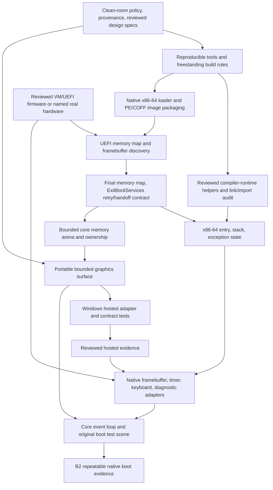

# Boot definitions and dependency graph

Status: B0 and hosted B1 verified; native boot contracts remain unachieved.

## Three distinct gates

**B0 — bootstrap build:** the documented tools compile a native Windows development
probe, a compile-only freestanding width probe, and run CTest. Two fresh build
directories produce the same probe executable hash with the pinned environment.
This is the first reproducible build; it is not an OS boot.

**B1 — first hosted ClasSICK start (M0.1):** a native Windows process initializes
our core using supplied arenas, renders an independently authored test scene
through an abstract surface, consumes normalized synthetic and live input, and
exits cleanly. Headless bounds/ownership/event tests pass. No Toolbox compatibility
claim is required to meet B1. This is a hosted development start.

Accepted 2026-10-08: SPEC-0001–0005 headless/hosted contracts, core import audits
and TEST-0009 x64 debugging pass. TEST-0010 adds a combined real message-loop
test, including synthetic and posted native messages, elapsed timing, pixels and
Escape shutdown. A separate owner-operated visible session delivered two Space
presses/releases and Escape, exiting zero after timer removal and arena retirement.
Posted messages alone were not counted as live keyboard evidence. The existing
B1/M0.1 technical gate passes; see [the audit](../development/hosted-start-audit.md).
Human provenance review, broad input/native drivers, native boot and historical
compatibility remain separate. No physical OS edition gate closes.

The owner named installed VirtualBox for future native-PC boot tests; read-only
version observation is 7.2.16r174877. No VM configuration, firmware/image adoption,
post-handoff device behavior or boot is verified. Review those inputs before B2.
Macintosh/mini vMac replacement-firmware validation remains a separate target;
VM results never close the original-hardware edition gate.

**B2 — first successful native OS boot (M0.2):** on one named x86-64 UEFI VM/PC
configuration, an independently built native image:

1. Loads without Apple code, a Macintosh machine environment, or a hosted OS
   process providing its kernel services.
2. Validates the firmware memory map and framebuffer descriptor; successfully
   calls `ExitBootServices` and transfers to our kernel-owned entry/stack.
3. Uses its own bounded memory arena, initializes required CPU exception state,
   and draws a deterministic original geometric scene through the core surface
   API using post-handoff framebuffer writes.
4. Maintains a visible progress counter for at least 60 seconds using an owned
   timing source. No boot-service callbacks provide ongoing execution or I/O.
5. Receives a keyboard event through our selected platform driver after handoff,
   changes the scene, and records a bounded diagnostic trace. The first VM may
   use a simple PS/2 device; USB-only PC support is a separate driver gate.
6. Has evidence tied to the source revision, toolchain hashes, image hash, firmware
   version/hash, machine configuration, boot transcript, and safe original-scene
   screenshot. Repeating from power-on yields the same observable pass sequence.

A firmware application showing text before handoff does not satisfy B2. The
kernel can initially use polling and cooperative execution; preemptive scheduling,
Toolbox, MFS, and a 68000 interpreter are not prerequisites for B2.

## Dependency graph for B2

ADR-0009 / TEST-0011 clears the current-core complete-link/second-compiler
checkpoint: no startup/default libraries or imports in eight Clang/GCC width/
optimization profiles, with exact entry checks and rejection controls. The
[fixtures](../development/core-link-evidence.md) were never loaded. This does not
clear firmware ABI, kernel entry/stack/exception setup, future runtime helpers or B2.

SPEC-0006 / TEST-0012 now validates bounded framebuffer/map/owned-span data and
the finite exit-outcome model through independent hosted tests. No firmware call
or hardware access occurs. [The proposed profile](../development/native-pc-profile.md)
defines loader/device ownership; exact selected firmware provenance remains
needs-review. [The snapshot](../development/uefi-contract-evidence.md) records
the full current 43-check Clang / 28-check scoped GCC matrix. Actual ABI/entry,
drivers and boot still require implementation and repeatable native observations.

Develop surface contracts using caller-owned test storage before kernel arena
integration. The diagram shows boot-time dependencies as well as implementation
gates; it does not require the allocator to precede surface design.

## Macintosh 128K native boot gate

M0.3 has a separate hardware/specification and size-budget gate. Our replacement
ROM/startup and native 68000 image must initialize required RAM, display, input,
exceptions and progress without executing Apple ROM code. Record the exact
hardware/VM and RAM/ROM map. Demonstrate cold-start behavior and guest trap entry
with an independently authored probe. If an emulator requires an Apple ROM to
initialize the machine, it cannot establish this gate.

The owner named mini vMac for Mac-image validation (SRC-0019). Select and review
its exact version/configuration and independent-firmware startup path before use.
Run our own ROM/startup and OS image, retain repeatable cold-start evidence, then
validate declared physical Macintosh hardware separately. Neither step is achieved.

No Apple ROM dump or disassembly is a design input. Published hardware evidence,
independent device experiments, and measured link maps establish the startup and
budget design. Macintosh native boot does not by itself prove System 1 API or
application compatibility.

## Firmware boundary research

SPEC-0006 / ADR-0010 specifies changed-map-key retries, bounded maps/framebuffers,
reserved allocations and the service-call boundary from reviewed UEFI interfaces
(SRC-0034, extending the earlier SRC-0005 lead). The proposed PC profile records
stack/entry/interrupt and post-handoff device obligations. SPEC-0007 / ADR-0011 now
implements original x64 calls and a stop scaffold, with hosted mocks and unloaded
EFI-image audits. SPEC-0008 / ADR-0012 now adds owned descriptor-table bytes and
terminal fault assembly, verified under hosted tests and unloaded image inspection.
Actual descriptor installation, fault delivery, device loop and native handoff
remain unobserved; [the snapshot](../development/x64-exception-evidence.md) pins scope.
SPEC-0009 / ADR-0013 adds the first post-handoff device leaf: a gated native
framebuffer presenter and original band-rendered scene. Hosted tests and unloaded
image linkage only. Presentation runs only after a recorded successful exit plus
ready descriptors; it uses at most 64 KiB of arena staging and never calls GOP Blt.
[The snapshot](../development/native-framebuffer-evidence.md) pins scope; visible
native output, timing, keyboard, diagnostics and B2 remain unobserved.
SPEC-0010 / ADR-0014 adds the owned time source candidate: pre-exit RSDP capture,
a bounded map-checked ACPI walk, 24/32-bit PM timer extension and a gated probe.
[The snapshot](../development/pm-timer-evidence.md) pins scope; real timer reads,
the 60-second loop, keyboard, diagnostics and B2 remain unobserved.
SPEC-0011 / ADR-0015 then runs one cooperative 60-second progress loop on that
timer ([snapshot](../development/progress-loop-evidence.md)); keyboard, UART and
B2 remain open, and nothing has executed natively.
Exact firmware eligibility, formatted boot media, Secure Boot and external VM/runtime
rights remain separate work. [The metadata follow-up](../development/firmware-eligibility.md)
identified the x64 producer and adopted no firmware. B2 remains unachieved.
