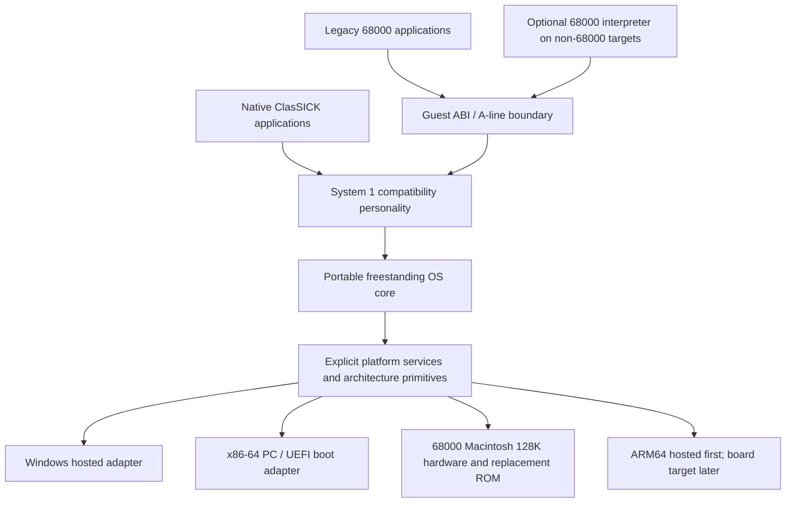

# Architecture overview

Status: initial design, governed by ADR-0001 through ADR-0008. These are project
choices, not claims about Apple's implementation.

On a real 68000, legacy instructions execute directly where feasible, but guest
trap/callback/low-memory boundaries still require adapters. Native C calling
conventions are not assumed to match historical Pascal/register conventions.

## Ownership and dependency rules

| Area | Owns | May depend on | Must not depend on |
| --- | --- | --- | --- |
| `core/` | Generic memory, surfaces, events, VFS, devices, timers, loading | Its contracts and explicit platform services | System 1 ABI, Win32, UEFI, Macintosh registers |
| `personality/system1/` | Historical semantics, handles, Toolbox managers, desktop policy | Core and guest ABI interfaces | Concrete hardware or a particular CPU interpreter |
| `formats/` | MFS and resource-fork codecs | Byte access and generic block/storage interfaces | Floppy controller, host endianness, native struct layout |
| `cpu/m68k/` | Optional application-instruction execution | Guest memory and trap/callback interfaces | Macintosh machine emulation or device registers |
| `arch/` | Entry, exceptions, context, CPU-only primitives | Architecture contracts | QuickDraw, MFS, desktop behavior |
| `platform/` | Device discovery, physical/host I/O, firmware handoff | Core/architecture interface contracts | Historical Toolbox semantics |
| `applications/` | Independently authored native examples and future desktop shell | Public core/personality APIs | Unreviewed reference executable payloads |

Avoid circular manager ownership. Build targets will express these dependencies;
core compilation and linked-import audits will reject platform leakage.

## Portable core rules

- Use a conservative C11 freestanding subset; fixed-width types for external data,
  `size_t` for native object sizes, explicit bounds and overflow checks.
- Guest pointers are integer addresses resolved through a guest memory service,
  never cast to native pointers. Host allocations may reside above 4 GiB.
- External formats are decoded bytewise with explicit byte order. Do not cast
  disk bytes to packed C structs or rely on bitfield ordering or unaligned access.
- No mandatory floating point, atomics, threads, MMU, or libc heap/stdio in core.
  Initial execution is cooperative and single-threaded; platform capabilities
  explicitly report unavailable services.
- Compiler-generated helpers such as integer division or memory copy are audited
  in freestanding links. Supply reviewed independent runtime helpers if needed.
- Architecture/platform assembly is minimal. Portable code cannot include CPU
  instructions, hardware register addresses, or hosted system headers.

## Memory and capability model

The core owns native allocations and device/surface lifetimes. The personality
owns guest-visible heaps, relocatable handles, classic address constraints, and
manager state. Logical separation is possible without an MMU; do not claim hostile
application isolation on a 68000/128K configuration.

Optional services are capabilities, not silent fallbacks. Unsupported operations
return defined errors. Compatibility profiles constrain visible resources without
globally imposing original hardware limits. The 128K configuration must have a
measured RAM/ROM budget and feature selection before promising the whole roadmap.

## Repository map

`docs/` contains charter, architecture, development, hardware research,
specifications, compatibility, ADRs, and testing. `provenance/` links evidence to
implementation. `scripts/` owns setup/guards. `tools/` owns developer utilities.
The source directories above initially contain ownership notes only.

Subsystem detail: [HAL](hal.md), [System 1 personality](system1.md),
[legacy applications](legacy-m68k.md), [hosted development](hosted-windows.md),
[boot gates](boot.md), [targets](targets.md).
